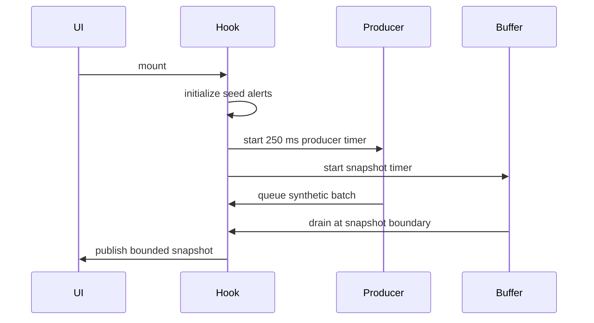
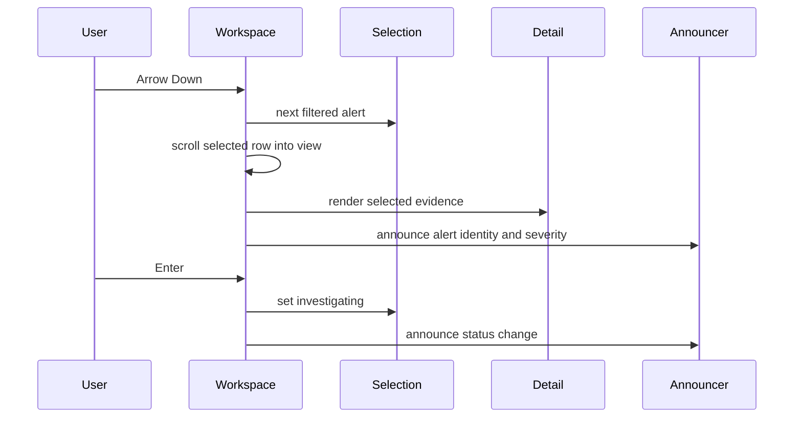
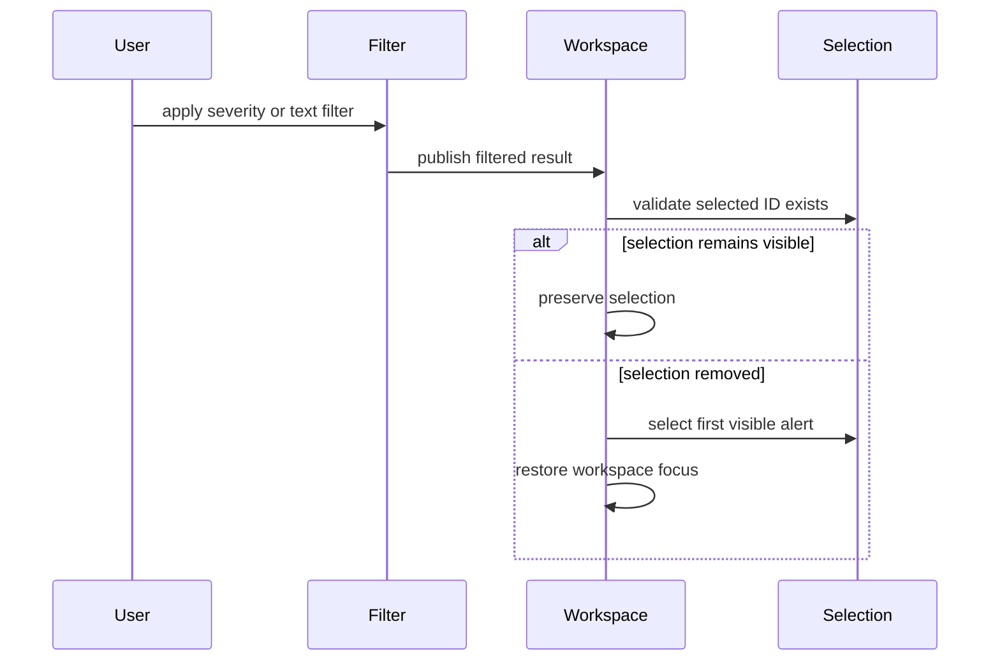
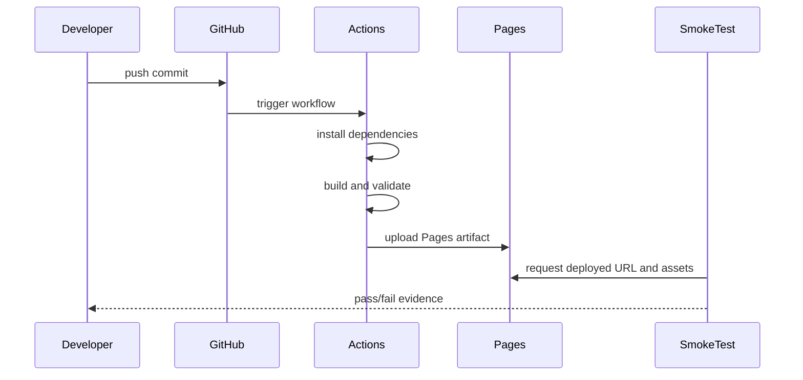

# Sequence Diagrams

## Synthetic stream startup

```mermaid
sequenceDiagram
    participant UI
    participant Hook
    participant Producer
    participant Buffer
    UI->>Hook: mount
    Hook->>Hook: initialize seed alerts
    Hook->>Producer: start 250 ms producer timer
    Hook->>Buffer: start snapshot timer
    Producer->>Hook: queue synthetic batch
    Buffer->>Hook: drain at snapshot boundary
    Hook->>UI: publish bounded snapshot
```

## Keyboard triage

```mermaid
sequenceDiagram
    participant User
    participant Workspace
    participant Selection
    participant Detail
    participant Announcer
    User->>Workspace: Arrow Down
    Workspace->>Selection: next filtered alert
    Workspace->>Workspace: scroll selected row into view
    Workspace->>Detail: render selected evidence
    Workspace->>Announcer: announce alert identity and severity
    User->>Workspace: Enter
    Workspace->>Selection: set investigating
    Workspace->>Announcer: announce status change
```

## Filtered selection recovery

```mermaid
sequenceDiagram
    participant User
    participant Filter
    participant Workspace
    participant Selection
    User->>Filter: apply severity or text filter
    Filter->>Workspace: publish filtered result
    Workspace->>Selection: validate selected ID exists
    alt selection remains visible
      Workspace->>Workspace: preserve selection
    else selection removed
      Workspace->>Selection: select first visible alert
      Workspace->>Workspace: restore workspace focus
    end
```

## Deployment release

```mermaid
sequenceDiagram
    participant Developer
    participant GitHub
    participant Actions
    participant Pages
    participant SmokeTest
    Developer->>GitHub: push commit
    GitHub->>Actions: trigger workflow
    Actions->>Actions: install dependencies
    Actions->>Actions: build and validate
    Actions->>Pages: upload Pages artifact
    SmokeTest->>Pages: request deployed URL and assets
    SmokeTest-->>Developer: pass/fail evidence
```
